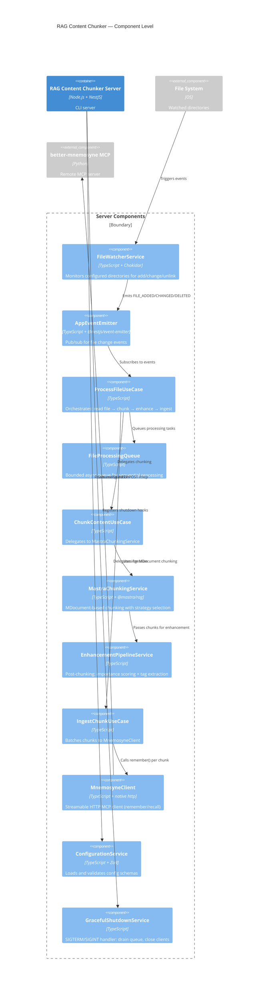

# Component: RAG Content Chunker — Server Components

## Diagram

## Elements

| ID | Name | Type | Technology | Description |
|----|------|------|-----------|-------------|
| `fileWatcher` | FileWatcherService | Component | Chokidar | Watches multiple configured directories with debounce per source |
| `eventBus` | AppEventEmitter | Component | @nestjs/event-emitter | Pub/sub event bus decoupling FileWatcher from ProcessFileUseCase |
| `processFile` | ProcessFileUseCase | Component | DDD UseCase | Main orchestration: read → chunk → enhance → ingest (via event handlers @OnEvent) |
| `fileQueue` | FileProcessingQueue | Component | Native TS | Bounded async queue — sequential processing, graceful drain on shutdown |
| `chunkContent` | ChunkContentUseCase | Component | DDD UseCase | Delegates to MastraChunkingService, applies enhancement pipeline |
| `mastraChunking` | MastraChunkingService | Component | @mastra/rag | Core chunking logic: MDocument factory → strategy selection → chunk → map to domain Chunk entities |
| `enhancement` | EnhancementPipelineService | Component | DDD Service | Post-chunking: ImportanceScoringService → TagExtractionService → namespace assignment |
| `ingestChunk` | IngestChunkUseCase | Component | DDD UseCase | Batches enhanced chunks to MnemosyneClient.remember() |
| `mnemosyneClient` | MnemosyneClient | Component | Native http | Streamable HTTP MCP client: initialize handshake, remember/recall, retry with backoff |
| `config` | ConfigurationService | Component | Zod | Parses YAML config, validates against Zod schemas, provides typed getters |
| `shutdown` | GracefulShutdownService | Component | Node.js signals | Handles SIGTERM/SIGINT: stops watchers, drains queue (30s), closes MnemosyneClient |

## Notes

- **DDD layers:** domain/ (entities/aggregates), application/ (services), use-cases/ (orchestration), infrastructure/ (external integration)
- **Result pattern:** All operations return `Result<T>` — zero exceptions for control flow
- **No Effect library:** Pure NestJS with Result pattern; domain events via @nestjs/event-emitter
