# Component: RAG Content Chunker — Server Components

## Diagram

```mermaid
C4Component
  title RAG Content Chunker — Component Level

  Container(server, "RAG Content Chunker Server", "Node.js + NestJS", "CLI server")

  Boundary(server, "Server Components", "Boundary") {
    Component(fileWatcher, "FileWatcherService", "TypeScript + Chokidar", "Monitors configured directories for add/change/unlink")
    Component(eventBus, "AppEventEmitter", "TypeScript + @nestjs/event-emitter", "Pub/sub for file change events")
    Component(processFile, "ProcessFileUseCase", "TypeScript", "Orchestrates: read file → chunk → enhance → ingest")
    Component(fileQueue, "FileProcessingQueue", "TypeScript", "Bounded async queue for sequential processing")
    Component(chunkContent, "ChunkContentUseCase", "TypeScript", "Delegates to StrategyRouter")
    Component(strategyRouter, "StrategyRouter", "TypeScript", "Routes to strategy based on sourceConfig.strategy")
    Component(agentSession, "AgentSessionChunkingStrategy", "TypeScript", "Frontmatter extraction + session metadata enrichment")
    Component(obsidian, "ObsidianChunkingStrategy", "TypeScript", "Note frontmatter extraction + tag merging")
    Component(sessionMetadata, "SessionMetadataService", "TypeScript", "Cached session.md metadata extraction (5-min TTL)")
    Component(mastraChunking, "MastraChunkingService", "TypeScript + @mastra/rag", "MDocument-based chunking with strategy selection")
    Component(enhancement, "EnhancementPipelineService", "TypeScript", "Post-chunking: importance scoring + tag extraction")
    Component(ingestChunk, "IngestChunkUseCase", "TypeScript", "Batches chunks to MnemosyneClient")
    Component(mnemosyneClient, "MnemosyneClient", "TypeScript + native http", "Streamable HTTP MCP client (remember/recall)")
    Component(config, "ConfigurationService", "TypeScript + Zod", "Loads and validates config schemas")
    Component(shutdown, "GracefulShutdownService", "TypeScript", "SIGTERM/SIGINT handler: drain queue, close clients")
  }

  Component_Ext(filesystem, "File System", "OS", "Watched directories")
  Component_Ext(mnemosyne, "better-mnemosyne MCP", "Python", "Remote MCP server")

  Rel(filesystem, fileWatcher, "Triggers events")
  Rel(fileWatcher, eventBus, "Emits FILE_ADDED/CHANGED/DELETED")
  Rel(eventBus, processFile, "Subscribes to events")
  Rel(processFile, fileQueue, "Queues processing tasks")
  Rel(processFile, chunkContent, "Delegates chunking")
  Rel(chunkContent, strategyRouter, "Delegates strategy selection")
  Rel(strategyRouter, agentSession, "agent-sessions strategy")
  Rel(strategyRouter, obsidian, "obsidian strategy")
  Rel(strategyRouter, mastraChunking, "content-aware strategy (default)")
  Rel(agentSession, sessionMetadata, "Extracts session metadata")
  Rel(agentSession, mastraChunking, "Delegates body chunking")
  Rel(obsidian, mastraChunking, "Delegates body chunking")
  Rel(mastraChunking, enhancement, "Passes chunks for enhancement")
  Rel(processFile, ingestChunk, "Delegates ingestion")
  Rel(ingestChunk, mnemosyneClient, "Calls remember() per chunk")
  Rel(mnemosyneClient, mnemosyne, "Streamable HTTP POST /mcp")
  Rel(server, config, "Reads configuration")
  Rel(server, shutdown, "Registers shutdown hooks")
```

## Elements

| ID | Name | Type | Technology | Description |
|----|------|------|-----------|-------------|
| `fileWatcher` | FileWatcherService | Component | Chokidar | Watches multiple configured directories with debounce per source |
| `eventBus` | AppEventEmitter | Component | @nestjs/event-emitter | Pub/sub event bus decoupling FileWatcher from ProcessFileUseCase |
| `processFile` | ProcessFileUseCase | Component | DDD UseCase | Separate handlers: handleAdd (ingest), handleChange (ingest + forget old), handleDelete (forget + clear). Dedup via processing Set (see memory 0007) |
| `fileQueue` | FileProcessingQueue | Component | Native TS | Bounded async queue — sequential processing, graceful drain on shutdown |
| `chunkContent` | ChunkContentUseCase | Component | DDD UseCase | Delegates to StrategyRouter, applies enhancement pipeline |
| `strategyRouter` | StrategyRouter | Component | TypeScript | Routes chunking to strategy based on `sourceConfig.strategy` (agent-sessions, obsidian, content-aware) |
| `agentSession` | AgentSessionChunkingStrategy | Component | TypeScript | Extracts frontmatter, enriches chunks with session metadata via SessionMetadataService, delegates body to Mastra |
| `obsidian` | ObsidianChunkingStrategy | Component | TypeScript | Extracts note frontmatter, merges tags, enriches chunks with note metadata, delegates body to Mastra |
| `sessionMetadata` | SessionMetadataService | Component | TypeScript | Cached extraction of session.md frontmatter (5-min TTL, in-memory Map, graceful degradation) |
| `mastraChunking` | MastraChunkingService | Component | @mastra/rag | Core chunking logic: MDocument factory → strategy selection → chunk → map to domain Chunk entities |
| `enhancement` | EnhancementPipelineService | Component | DDD Service | Post-chunking: ImportanceScoringService → TagExtractionService → namespace assignment |
| `ingestChunk` | IngestChunkUseCase | Component | DDD UseCase | Batches enhanced chunks to MnemosyneClient.remember() |
| `mnemosyneClient` | MnemosyneClient | Component | Native http | Streamable HTTP MCP client: initialize handshake, remember/recall, retry with backoff |
| `config` | ConfigurationService | Component | Zod | Parses YAML config, validates against Zod schemas, provides typed getters |
| `shutdown` | GracefulShutdownService | Component | Node.js signals | Handles SIGTERM/SIGINT: stops watchers, drains queue (30s), closes MnemosyneClient |

## Notes

- **DDD layers:** domain/ (entities/aggregates), application/ (services), use-cases/ (orchestration), infrastructure/ (external integration)
- **Result pattern:** All operations return `Result<T>` — zero exceptions for control flow
- **No Effect library:** Pure NestJS with Result pattern; domain events via @nestjs/event-emitter
