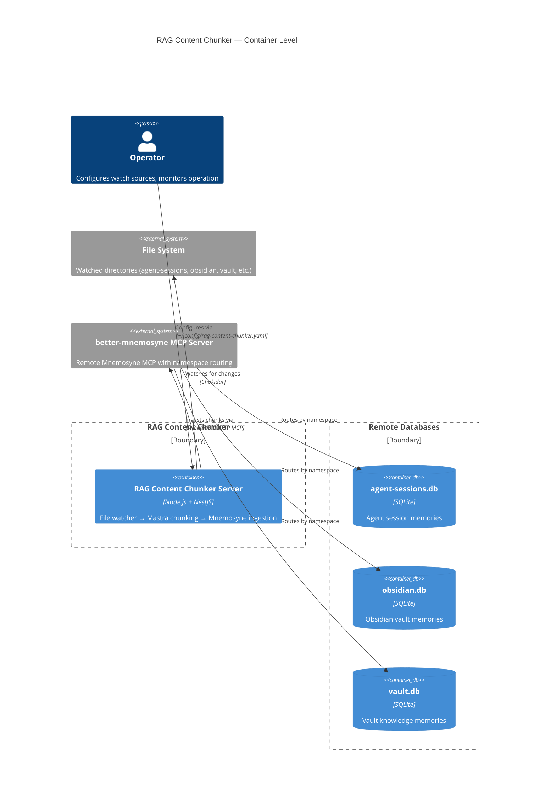

# Container: RAG Content Chunker — Server Container

## Diagram

## Elements

| ID | Name | Type | Technology | Description |
|----|------|------|-----------|-------------|
| `server` | RAG Content Chunker Server | Container | Node.js + NestJS 11 | Single-process CLI server: watches files, chunks via Mastra, enhances, ingests to Mnemosyne |
| `filesystem` | File System | System_Ext | — | Watched directories defined in config (up to multiple sources) |
| `mnemosyne` | better-mnemosyne MCP Server | System_Ext | Python + MCP | Remote namespace-aware Mnemosyne server; routes per namespace to separate SQLite DBs |

## Notes

- **Single-container design:** RAG Content Chunker is a single NestJS CLI process — no separate workers, APIs, or microservices
- **Transport:** Streamable HTTP (not SSE, not stdio) — SSE deprecated in Mnemosyne due to init handshake races
- **Ephemeral:** No database on RAG Content Chunker side — all state stored in remote Mnemosyne databases
- **Graceful shutdown:** SIGTERM/SIGINT → stop watchers → drain queue → close Mnemosyne client (30s timeout)
